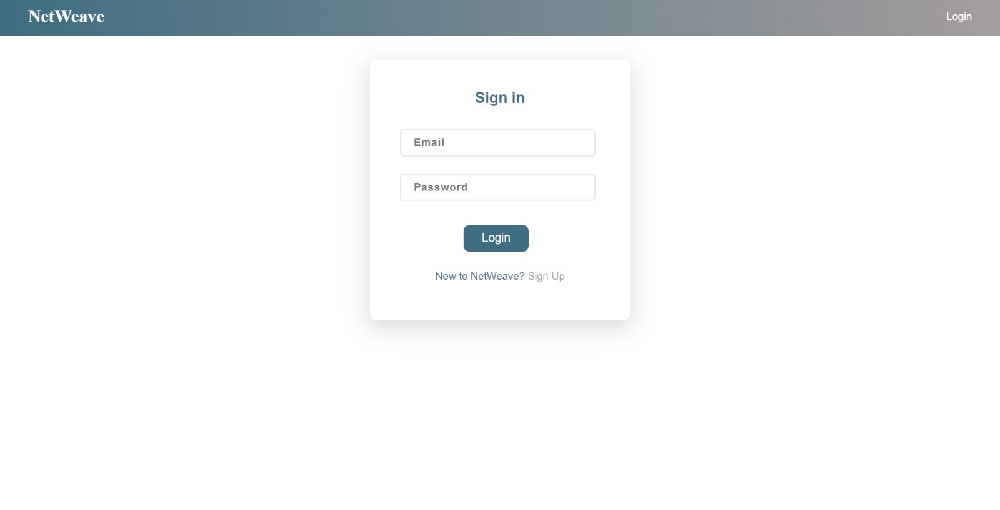
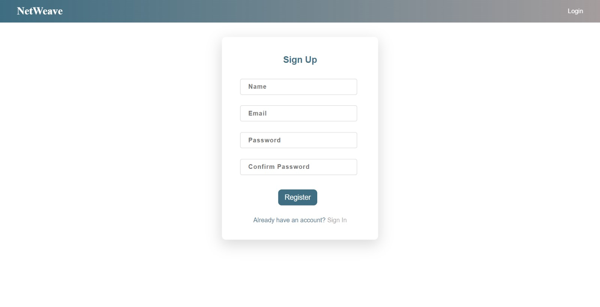
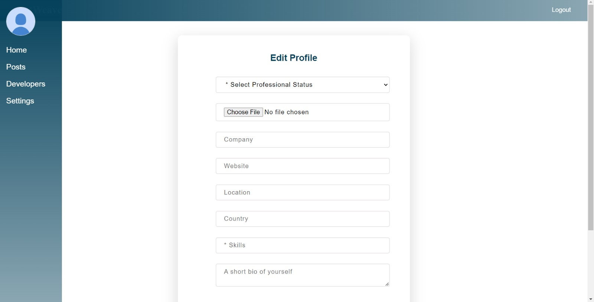
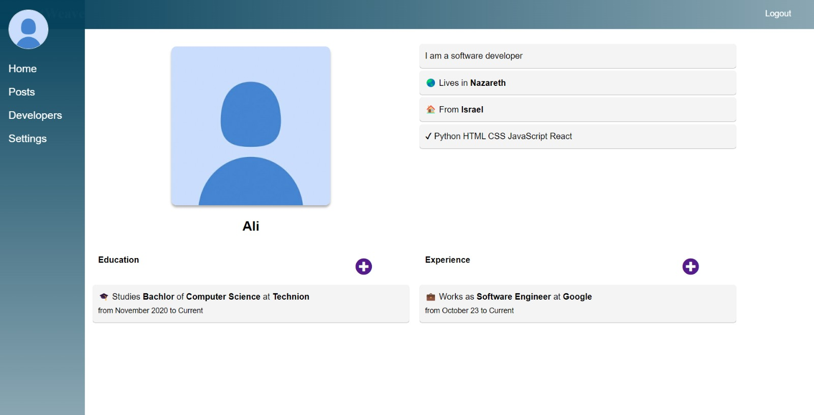
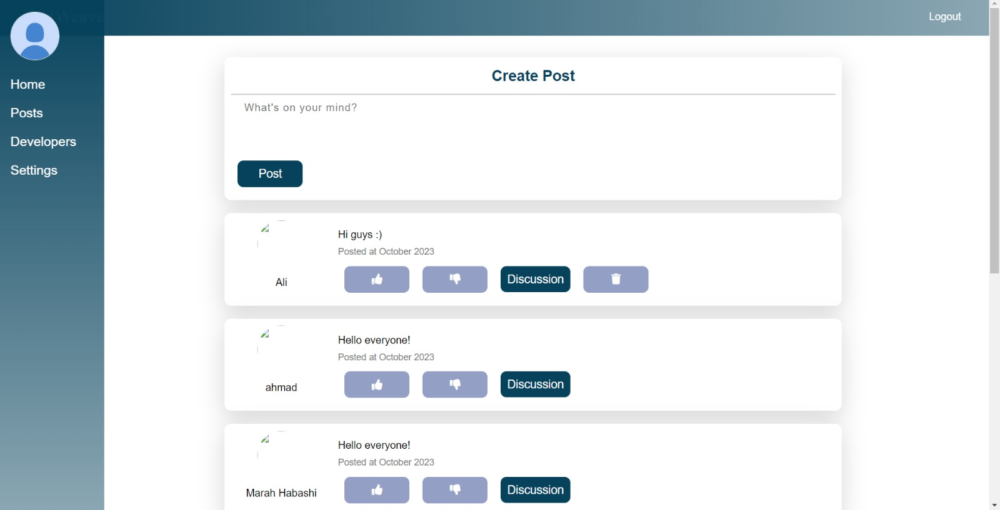
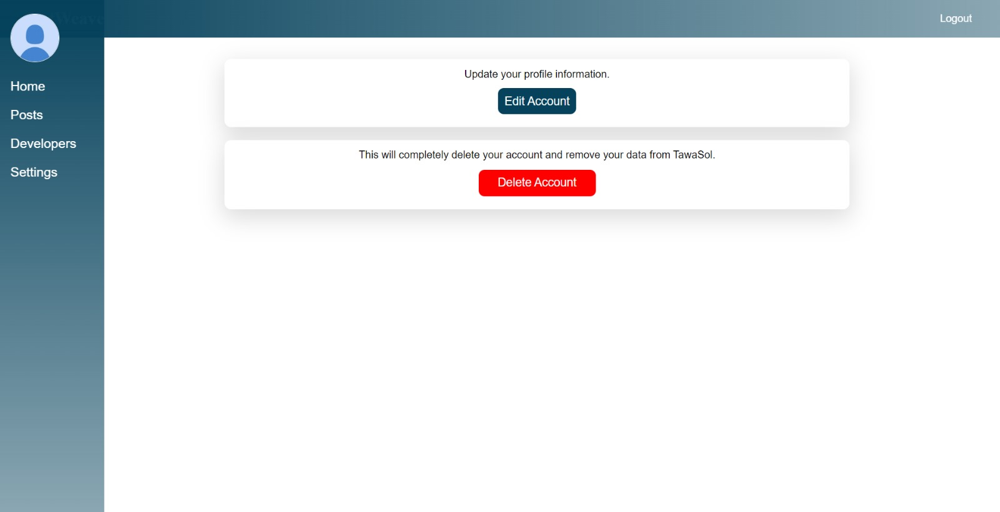

## 🚩 NetWeave - Professional Network for Engineers
Welcome to NetWeave, a social media web platform developed to connect engineers and professionals from various technical backgrounds. NetWeave provides a space for networking, knowledge sharing, and career development within the engineering community. 

## 〰️ Table of Contents
🔸 About NetWeave \
🔸 Features \
🔸Tech Stack \
🔸 Project Presentation Video\
🔸 Project Pages


## 〰️ About NetWeave
This name combines "net," which implies networks or connections, with "weave," suggesting the interwoven relationships and connections that users can explore and create on the platform.

## 〰️ Features
🔹 User Registration and Authentication\
🔹 User Profiles with Work Experience and Skills \
🔹 News Feed for Posting Updates\
🔹 Like and Comment on Posts\
🔹 Responsive Design for Mobile and Desktop

## 〰️ Tech Stack

NetWeave is built using the following technologies:

 **Frontend:**

✅ React.js \
✅ Redux (for state management) \
✅ HTML and CSS 

**Backend:**

✅ Node.js with Express.js \
✅ MongoDB (as the database)

## 〰️ Getting Started:

**Prerequisites**
Before you begin, ensure you have the following installed on your system:
- **Node js**
- **MongoDB**
- **Git**

**Installation**

1. Clone the repository:
   ```
   https://github.com/MarahHab/Social_Media_Web.git
   ```


## 〰️ Project Pages

##  🏠 Home Page

- **Description**: The home page serves as the main entry point to the application, displaying relevant content and providing navigation options.

## 🔐 Sign In Page

- **Description**: The sign-in page allows users to log in to their accounts with their credentials.

## 📝 Sign Up Page

- **Description**: The sign-up page enables new users to register for an account by providing necessary information.

## 🧑‍🤝‍🧑 Create Your Profile Page

- **Description**: Users can set up their profiles by adding personal information, such as a profile picture Skills, Education,Experiencr,bio ect...

## 👤 Profile Page

- **Description**: The profile page displays user-specific information, such as posts, comments, and profile details.

## ✍ Post Content Page

- **Description**: Users can create, like, and unlike posts on this page. It's a hub for sharing content with the community.

## ⚙ Settings Page

- **Description**: The settings page offers options to edit the user's account information, change preferences, and delete the account.
